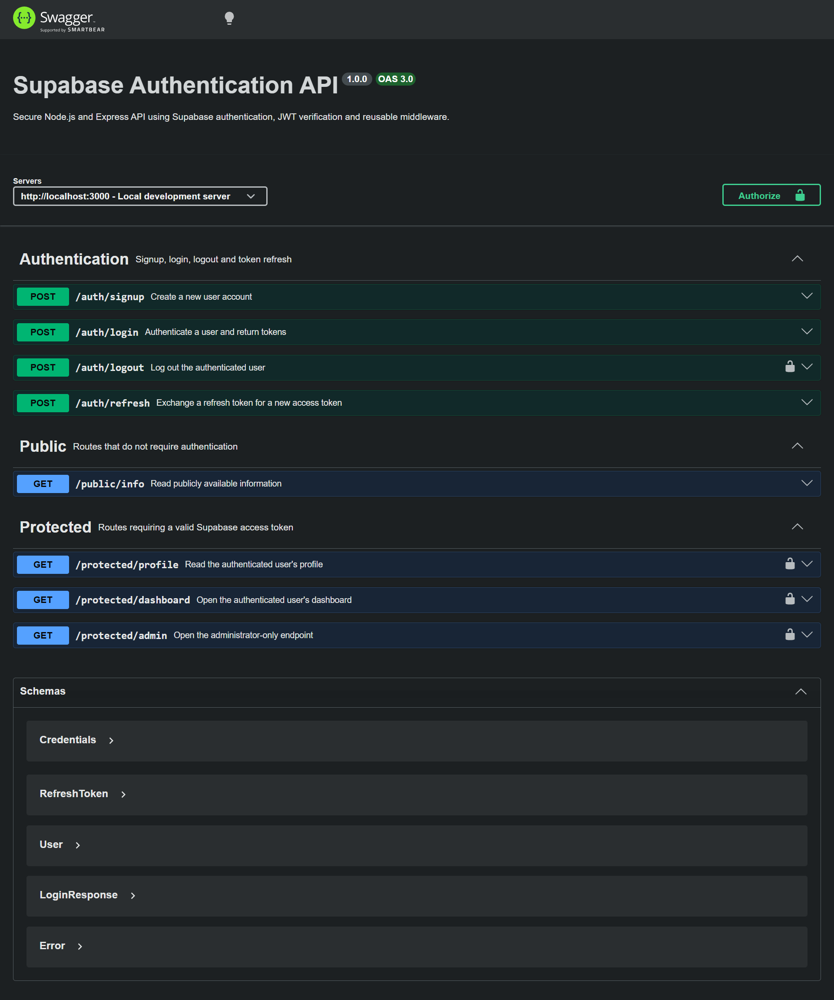

# Supabase Authentication API

A secure REST API built with Node.js, Express and Supabase Auth.

The project supports user registration, login, logout, refresh tokens,
JWT verification, protected routes, reusable authentication middleware,
role-based authorization and Swagger UI documentation.

## Features

- User signup with email and password
- User login with access and refresh tokens
- Supabase JWT verification
- Reusable Express authentication middleware
- Protected profile and dashboard routes
- Administrator-only route demonstrating HTTP 403
- Logout endpoint
- Refresh-token endpoint
- Login rate limiting
- Swagger UI bearer authentication
- Centralized API error handling
- Environment-variable configuration

## Technology Stack

- Node.js
- Express
- Supabase Auth
- JSON Web Tokens
- Swagger UI
- OpenAPI 3
- express-rate-limit
- Helmet
- CORS

## Project Structure

```text
src/
├── config/
│   └── supabase.js
├── controllers/
│   └── authController.js
├── docs/
│   └── openapi.js
├── middleware/
│   ├── authMiddleware.js
│   └── errorMiddleware.js
├── routes/
│   ├── authRoutes.js
│   ├── protectedRoutes.js
│   └── publicRoutes.js
├── app.js
└── server.js
```

## Environment Setup

Copy the example environment file:

```bash
cp .env.example .env
```

Windows Command Prompt:

```cmd
copy .env.example .env
```

Add your own Supabase values:

```env
SUPABASE_URL=https://your-project-id.supabase.co
SUPABASE_KEY=your-supabase-anon-key
PORT=3000
NODE_ENV=development
```

Never commit `.env` or a Supabase `service_role` key.

## Installation

```bash
npm install
```

## Run in Development

```bash
npm run dev
```

## Run Normally

```bash
npm start
```

The API runs at:

```text
http://localhost:3000
```

Swagger UI is available at:

```text
http://localhost:3000/docs
```

## API Reference

| Method | Endpoint | Authentication | Description |
|---|---|---:|---|
| POST | `/auth/signup` | No | Create a user |
| POST | `/auth/login` | No | Log in and receive tokens |
| POST | `/auth/logout` | Yes | Log out the current user |
| POST | `/auth/refresh` | No | Exchange refresh token |
| GET | `/public/info` | No | Read public information |
| GET | `/protected/profile` | Yes | Read current user profile |
| GET | `/protected/dashboard` | Yes | Read protected dashboard |
| GET | `/protected/admin` | Admin | Read administrator content |

## Authentication Header

Protected routes require:

```http
Authorization: Bearer YOUR_ACCESS_TOKEN
```

## Status Codes

| Code | Meaning |
|---:|---|
| 200 | Request succeeded |
| 201 | User created |
| 204 | Logout succeeded with no response body |
| 400 | Invalid or missing request data |
| 401 | Missing, malformed, invalid or expired authentication |
| 403 | User is authenticated but is not allowed |
| 404 | Route not found |
| 429 | Too many failed login attempts |
| 500 | Internal server error |

## 401 vs 403

`401 Unauthorized` means that the server cannot authenticate the caller.
The token may be missing, malformed, invalid or expired.

`403 Forbidden` means that the caller has been authenticated, but does
not have permission to perform the requested operation.

## Access and Refresh Tokens

Access tokens are short-lived because they are sent with protected API
requests. A refresh token can obtain a new access token without requiring
the user to enter their email and password again.

Because JWT access tokens are stateless, logging out may revoke the
session or refresh tokens while the existing access token remains valid
until it expires.

## Rate Limiting

The login endpoint allows five failed login attempts within a fifteen-minute
window. Additional failed attempts receive HTTP 429.

Rate limiting helps reduce automated password guessing and brute-force
login attempts.

## Testing With curl

### Signup

```bash
curl -i -X POST http://localhost:3000/auth/signup \
  -H "Content-Type: application/json" \
  -d "{\"email\":\"test@example.com\",\"password\":\"password123\"}"
```

### Login

```bash
curl -i -X POST http://localhost:3000/auth/login \
  -H "Content-Type: application/json" \
  -d "{\"email\":\"test@example.com\",\"password\":\"password123\"}"
```

### Public route

```bash
curl -i http://localhost:3000/public/info
```

### Protected route

```bash
curl -i http://localhost:3000/protected/profile \
  -H "Authorization: Bearer YOUR_ACCESS_TOKEN"
```

### Logout

```bash
curl -i -X POST http://localhost:3000/auth/logout \
  -H "Authorization: Bearer YOUR_ACCESS_TOKEN"
```

## Swagger Screenshot



## Security Decisions

- Passwords are never stored by this Express API.
- Supabase handles password hashing and account storage.
- JWTs are verified through `supabase.auth.getUser(token)`.
- Bearer headers are parsed strictly.
- Supabase errors are not exposed with internal stack traces in production.
- `.env` is excluded from Git.
- The `service_role` key is not used.
- Request bodies are limited to 10 KB.
- Helmet adds common HTTP security headers.
- Login attempts are rate-limited.

## AI vs Me

### Original Prompt

Build a secure Node.js and Express REST API using Supabase Auth as the
identity provider.

Add POST `/auth/signup`, POST `/auth/login`, POST `/auth/logout`,
GET `/public/info`, and GET `/protected/profile`.

Signup must return 201, login and reads must return 200, logout must
return 204, missing input must return 400, and missing or invalid tokens
must return 401.

Verify bearer access tokens using reusable Express middleware and
`supabase.auth.getUser(token)`. Add Swagger UI at `/docs` using an
OpenAPI bearer security scheme. Environment variables must be read
from a git-ignored `.env` file.

### Comparison

1. My implementation strictly checks the `Bearer ` prefix using a regular
   expression. A weaker implementation might accept a raw token or crash
   when the header is malformed.

2. My middleware checks both the Supabase error and the returned user.
   Trusting only the returned data without checking the error could result
   in incorrect authentication behaviour.

3. My implementation avoids logging tokens and never uses the
   `service_role` key.

4. The original prompt did not specify rate limiting, request-size limits,
   centralized error handling or security headers. These decisions had to
   be added explicitly.

### Improved Prompt

Build a secure Node.js ES-module Express API using Supabase Auth.

Strictly accept only `Authorization: Bearer <token>`, reject missing or
malformed headers with 401, verify the JWT with
`supabase.auth.getUser(token)`, check both the error and user result, and
attach the authenticated user to `req.user`.

Implement signup, login, logout, public information, protected profile
and protected dashboard routes. Never log credentials or tokens and
never use the Supabase `service_role` key.

Use correct HTTP status codes, add centralized JSON error handling,
Helmet, a 10 KB JSON limit and rate-limit failed login attempts. Document
the API in Swagger UI using an OpenAPI bearer authentication scheme.

### Rematch Result

The improved prompt produced stricter bearer-token parsing, safer error
handling and clearer security requirements than the original prompt.

## Licence

MIT